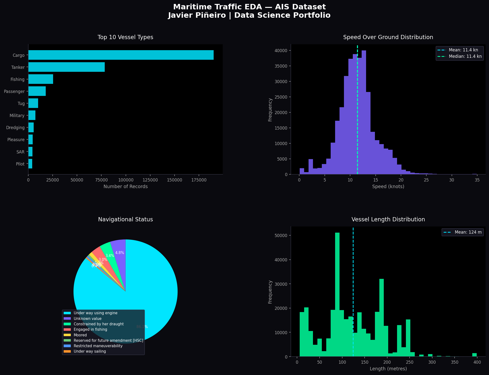

# 🚢 Maritime Traffic EDA — AIS Dataset Analysis

Exploratory data analysis on a real AIS dataset with **358,351 vessel records** and **3,894 unique vessels**.

## 📊 Results

## 🔍 What this project does

- Analyses vessel type distribution across maritime traffic
- Studies Speed Over Ground (SOG) patterns
- Examines navigational status breakdown
- Explores vessel length distribution

## 📌 Key Findings

- Cargo vessels dominate traffic (most recorded type)
- Average speed: **11.4 knots**
- Average vessel length: **124 metres**
- Most vessels are under way using engine

## 🛠️ Tech Stack

`Python 3.11` `Pandas` `Matplotlib` `Seaborn`

## 👤 Author

**Javier Piñeiro** — Data Science MSc (UOC) | Naval Engineer  
[Fiverr Profile](https://www.fiverr.com/javier_pineiro)
